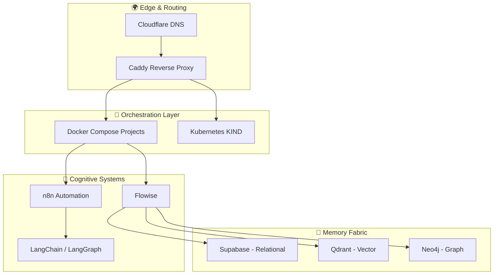

# 🧠 mindset-dev
### *Cognitive Infrastructure Showcase*

**Self-hosted AI systems running on Hostinger.**  
Multi-agent frameworks, vector databases, and reasoning engines — all documented and production-ready.

---

## 🌍 What is mindset-dev?

**mindset-dev** is where **DevOps discipline evolves into cognitive automation** — a living laboratory for exploring how infrastructure can reason, adapt, and collaborate.

We're building AI-native systems that blend:
- 🐳 **Container Orchestration** (Docker Compose, Kubernetes KIND)
- 🧠 **Cognitive Frameworks** (Flowise, LangChain, LangGraph, n8n)
- 💾 **Intelligent Data Layers** (Supabase, Qdrant, Neo4j)
- 🌐 **Production Infrastructure** (Caddy, Cloudflare, Self-Hosted)

> *"Infrastructure is not just automation — it's cognition."*

---

## 🏗️ Featured Projects

<table>
<tr>
<td width="50%" valign="top">

### 🧠 [ai-infra-hostinger](https://github.com/mindset-dev/ai-infra-hostinger)
**Meta-Repository | Architecture Documentation**

The blueprint of our cognitive infrastructure. Comprehensive documentation covering:
- System architecture & network topology
- Multi-project Docker orchestration
- Kubernetes KIND cluster setup
- AI stack design philosophy

**Status:** 📚 Production Documentation  
**Tech:** Mermaid, Markdown, Architecture-as-Code

</td>
<td width="50%" valign="top">

### 🔌 [local-ai-packaged](https://github.com/mindset-dev/local-ai-packaged)
**Full-Stack AI Deployment | Docker Compose**

Heavily customized fork providing complete self-hosted AI stack:
- Flowise + LangChain orchestration
- Open WebUI for LLM interaction
- Supabase + Qdrant + Neo4j data layers
- Caddy reverse proxy with TLS
- Multiple running projects (maui, o3, mem0)

**Status:** 🚀 Production Active  
**Tech:** Docker, n8n, Ollama, FastAPI

</td>
</tr>

<tr>
<td width="50%" valign="top">

### 💬 [maui (Mental Health App)](https://github.com/mindset-dev/maui)
**AI-Powered Mental Wellness Platform**

Multi-agent cognitive automation for mental health support.
- FastAPI backend with AI reasoning
- Integrated with localai cognitive layer
- Vector memory for contextual journaling

**Status:** 🔄 In Development  
**Tech:** Python, FastAPI, Postgres, Redis

</td>
<td width="50%" valign="top">
    
### 🔌 [bigtorig-mcp-hub](https://github.com/mindset-dev/bigtorig-mcp-hub)
**Model Context Protocol Server**

MCP server providing unified AI access to infrastructure:
- FastMCP-based server on KIND cluster
- Postgres, Qdrant, Neo4j integration
- Deployed at `mcp.bigtorig.com`

**Status:** 🚀 Ready for Deployment  
**Tech:** Python, FastMCP, Kubernetes, UV

---

## 🧩 The Cognitive Stack

Our infrastructure operates as a **distributed intelligence system** where each component contributes to collective reasoning:

### Core Technologies

| Layer | Tools | Purpose |
|-------|-------|---------|
| **Edge** | Cloudflare, Caddy | DNS, SSL/TLS, Reverse Proxy |
| **Orchestration** | Docker Compose, KIND | Container management & K8s experimentation |
| **AI Frameworks** | Flowise, LangChain, LangGraph, n8n | Agentic workflows & reasoning |
| **Data Memory** | Supabase, Qdrant, Neo4j | Structured, semantic, and graph intelligence |
| **LLM Inference** | Ollama, LocalAI | Self-hosted language models |
| **Observability** | Langfuse, Grafana, Loki | Cognitive telemetry & system metrics |
| **Languages** | Python, TypeScript, YAML, HCL | Development & infrastructure-as-code |

---

## 🏛️ Architecture Philosophy

### **Infrastructure as Cognition**

We don't just automate — we build systems that **think, learn, and adapt**.

**Principles:**
1. 🧠 **Modularity** — Every component is a replaceable cognitive unit
2. 📊 **Observability** — Insight is the feedback loop of intelligence
3. 🔄 **Resilience** — Cognitive systems heal through orchestration
4. 🏠 **Locality** — Self-hosted intelligence within our control

### **From DevOps to CogOps**

Traditional DevOps automates infrastructure.  
**Cognitive DevOps** creates infrastructure that reasons about itself.

- Pipelines that understand context
- Agents that deploy other agents
- Systems that introspect and evolve

---

## 🎯 Use Cases & Experiments

Current explorations include:

- 🤖 **AI-Driven K8s Management** — Self-healing clusters via LangGraph agents
- 🧬 **Cognitive Memory Systems** — Vector + Graph hybrid reasoning
- 🔁 **Agentic Workflows** — n8n + Flowise orchestration chains
- 🏥 **Healthcare AI** — OpenMRS integration with cognitive layers
- 📊 **Observability as Reasoning** — Langfuse for LLM introspection

---

## 🚀 Getting Started

### Explore Our Documentation
👉 **[ai-infra-hostinger Docs](https://github.com/mindset-dev/ai-infra-hostinger)** — Architecture, network topology, and system design

### Deploy the Stack
👉 **[local-ai-packaged](https://github.com/mindset-dev/local-ai-packaged)** — Full Docker Compose setup with installation guide

### Join the Journey
This is an open exploration of AI-native infrastructure. Watch our repos, try our setups, and contribute ideas.

---

## 🧭 Roadmap

**Phase 1: Foundation** ✅
- [x] Core AI stack deployment
- [x] Comprehensive documentation
- [x] Multi-project orchestration

**Phase 2: Expansion** 🔄
- [ ] LangGraph control plane
- [ ] FastMCP integration
- [ ] Public observability dashboard
- [ ] MkDocs documentation site

**Phase 3: Cognitive Systems** 🔮
- [ ] Self-learning infrastructure
- [ ] Agent-to-agent orchestration
- [ ] Federated multi-server mesh
- [ ] AI-driven network routing

---

## 🌟 Connect

**mindset-dev** is part of the broader DevOps journey documented at [@journeyman33](https://github.com/journeyman33)

🔗 [AI Infrastructure Docs](https://github.com/mindset-dev/ai-infra-hostinger) • 🌐 [Blog](https://journeyman33.github.io/k8s-resume-blog/) • 💼 [Portfolio](https://github.com/journeyman33)

---

*Where automation evolves into cognition.* 🧠⚡

